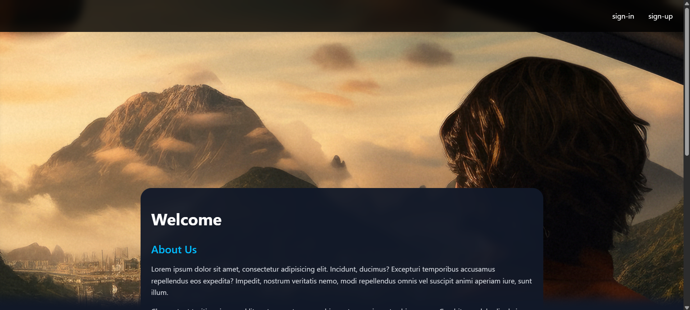
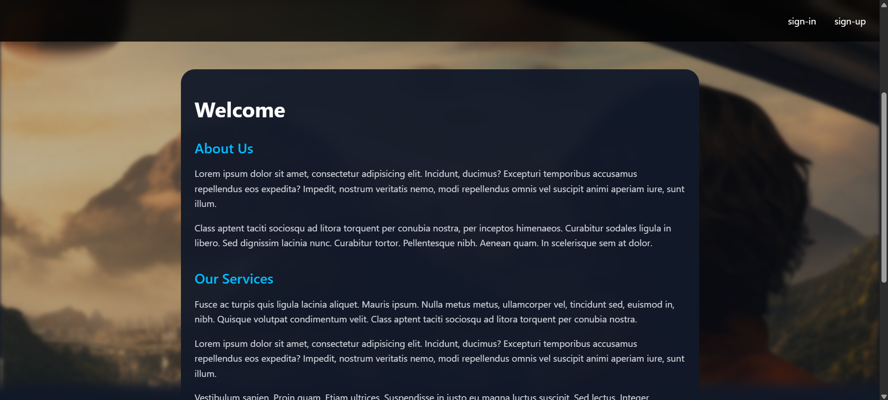
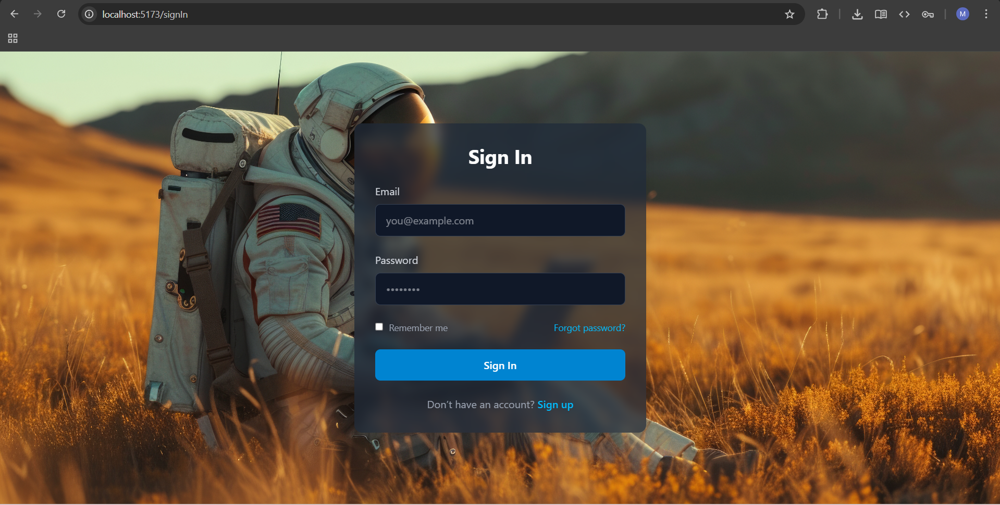
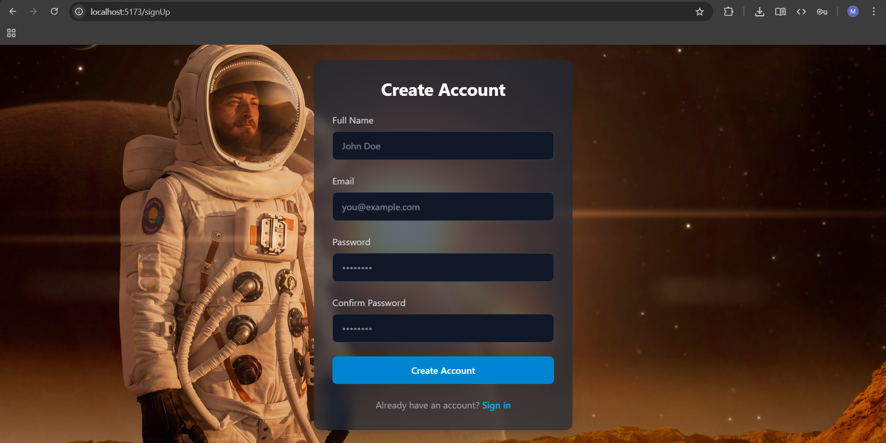

# CLI-NVG — React Application

## 🚀 Overview

CLI-NVG is a modern single-page application built with **React**, created using the **React CLI tooling**, and structured around **React Router** for client-side navigation.

The project demonstrates best practices on:

* Folder structure organization
* Routing between pages
* Reusable components
* UI styling with Tailwind CSS
* Scroll effects and background animations

---
## Screeshots
Home

Home

Sign in

Sign up

---

## 🏗️ Tech Stack

| Technology           | Purpose                                     |
| -------------------- | ------------------------------------------- |
| **React**            | Main UI library                             |
| **React Router**     | Page navigation and routing                 |
| **React CLI**        | Project scaffolding and development tooling |
| **Tailwind CSS**     | Fast and responsive styling                 |
| **JavaScript / JSX** | Component logic and UI rendering            |

---

## 📂 Project Structure

```
src/
 ├─ assets/               # Static images and files
 ├─ pages/                # Application pages
 │   ├─ home/             # Home page
 │   └─ login/            # Login page
 ├─ App.jsx               # Routing configuration
 ├─ main.jsx              # Entry point
 └─ index.css             # Global styles
```

---

## 🔀 Routing

Navigation is handled with **React Router v6**.

### Example of routes:

```jsx
import { BrowserRouter, Routes, Route } from "react-router-dom";
import Home from "./pages/home";
import Login from "./pages/login";
import SignUp from "./pages/signUp";

export default function App() {
  return (
    <BrowserRouter>
      <Routes>
        <Route path="/" element={<Home />} />
        <Route path="/login" element={<Login />} />
        <Route path="/signUp" element={<SignUp />} />
      </Routes>
    </BrowserRouter>
  );
}
```

✔ No page reload
✔ Fast navigation
✔ URL-based routing

---

## 🎨 UI & Styling

The interface is built with **Tailwind CSS**, using:

* Utility-first classes
* Responsive layouts
* Blur and transparency
* Background images and parallax effects

### Example:

```jsx
<div
  className="min-h-screen bg-cover bg-center"
  style={{ backgroundImage: `url(${bgImage})` }}
>
```

---

## 🧭 Pages Included

### 🏠 Home Page

* Hero section with scroll effects
* Navigation links (`Login`, `Sign Up`)
* Dynamic background resizing

### 🔐 Login Page

* Email + password inputs
* Styled form layout
* Redirect link to Sign Up

### 📝 Sign Up Page

* Name, email, password fields
* Matching visual style
* Redirect link back to Login

---

## ▶️ Running the Project

### Install dependencies:

```bash
npm install
```

### Start the development server:

```bash
npm run dev
```

Then open:

👉 [http://localhost:5173](http://localhost:5173)

---

## 📦 Build for Production

```bash
npm run build
```

Creates an optimized build in:

```
dist/
```

---

## 🤝 Contributing

Feel free to open issues or submit pull requests.
Suggestions for additional features are welcome!

---

## 📄 License

This project is released under the **MIT License**.

---

## 🌟 Summary

CLI-NVG is a practical example of:

* React application setup with React CLI
* Navigation through React Router
* Tailwind UI design
* Image backgrounds & animation effects


Use it as a base or template for larger applications.

